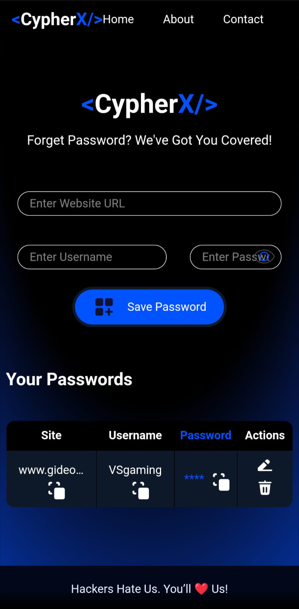

# CypherX - Password Manager

CypherX is a state-of-the-art password manager designed to keep your credentials secure and easily accessible. With a sleek and intuitive interface, CypherX ensures that you never have to worry about forgetting your passwords again.

**[Live Demo](https://cypherx-by-vs.netlify.app/)**

## Project Showcase (Click on Image to View)

[](https://youtu.be/BS4hkdxhiHg)

## Web-Based Design

<p align="center">
  
  
  
</p>

<!-- screen shots of mobile design -->

## Mobile-Friendly Design

<p align="center">
  
  
</p>

## Features

### 1. Secure Password Storage
- **MongoDB Integration**: Passwords are securely stored in a MongoDB database.
- **Encryption**: All passwords are encrypted before being stored in the database, ensuring maximum security.

### 2. User-Friendly Interface
- **Responsive Design**: The application is fully responsive and works seamlessly on all devices.
- **Intuitive UI**: Easy-to-use interface with clear instructions and feedback.

### 3. Password Management
- **Add Passwords**: Users can add new passwords with site name, username, and password.
- **Edit Passwords**: Users can edit existing passwords.
- **Delete Passwords**: Users can delete passwords they no longer need.
- **Copy to Clipboard**: Users can copy passwords to the clipboard with a single click.

### 4. Real-Time Feedback
- **Toast Notifications**: Real-time notifications for actions like saving, deleting, and copying passwords.

### 5. Modern Technologies
- **React**: Built with React for a dynamic and responsive user experience.
- **Vite**: Utilizes Vite for fast development and optimized builds.
- **Tailwind CSS**: Styled with Tailwind CSS for a modern and clean design.
- **Express**: Backend server built with Express for handling API requests.
- **ESLint**: Code quality maintained with ESLint and custom rules.

## Getting Started

### Prerequisites
- Node.js
- MongoDB

### Installation

1. Clone the repository:
   ```sh
   git clone https://github.com/your-username/password-manager.git
   cd password-manager
   ```

2. Install dependencies:
   ```sh
   npm install
   ```

3. Set up environment variables:
   Create a `.env` file in the root directory and add your MongoDB connection string and other necessary environment variables.

4. Start the development server:
   ```sh
   npm run dev
   ```

5. Open your browser and navigate to `http://localhost:3000` to see the application in action.

## KEY POINTS

- **Full-Stack Development**: Demonstrates proficiency in both frontend and backend development.
- **Secure Data Handling**: Utilizes MongoDB for secure data storage with encryption, showcasing knowledge in database management and security best practices.
- **Modern Tech Stack**: Built with React, Vite, Tailwind CSS, and Express, highlighting familiarity with modern web development technologies.
- **Responsive Design**: Ensures a seamless user experience across all devices.
- **Real-Time Feedback**: Provides a dynamic user experience with real-time notifications.

